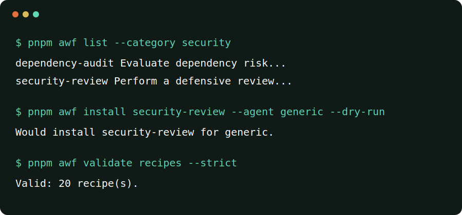

# Agentic Workflows

Evidence-oriented workflow bundles and locally verified exporters for AI coding agents.

Use structured workflows for code review, CI debugging, migrations, security review, testing, documentation, and maintenance across multiple coding agents.



Agentic Workflows is a structured catalog with an offline installer, not a loose prompt list.
Every recipe declares inputs, preconditions, observable steps, decision points, safety guardrails, human approvals, expected outputs, completion criteria, examples, adapter status, and independent verification stages.

[Read in Brazilian Portuguese](README.pt-BR.md)

## Quick start

The packages are not published to npm.
Clone the repository over HTTPS and run the local CLI:

```bash
git clone https://github.com/kauanpolydoro/agentic-workflows.git
cd agentic-workflows
corepack enable
pnpm install --frozen-lockfile
pnpm build
pnpm validate
pnpm awf list
pnpm awf show review-pull-request
```

Use `git@github.com:kauanpolydoro/agentic-workflows.git` instead only when your SSH credentials are already configured.

Preview a local installation without writing files:

```bash
pnpm awf install review-pull-request --agent generic --dry-run
```

Package-registry installation is a future release step and is not currently available.

## Featured workflows

- `review-pull-request` reviews correctness, regression, security, maintainability, and test evidence.
- `debug-failing-ci` moves from the first causal log through falsifiable hypotheses to a minimal fix.
- `database-migration-review` evaluates locks, data loss, mixed-version compatibility, and rollout recovery.
- `security-review` stays strictly defensive and requires explicit authorized scope.

[Browse all 20 workflows on the documentation site](https://kauanpolydoro.github.io/agentic-workflows/catalog/), or inspect the [generated catalog source](docs/catalog/index.md).

## See a complete result

The `write-release-notes` golden recipe includes a [self-contained synthetic input](recipes/write-release-notes/examples/input.md) and its [complete expected release-note artifact](recipes/write-release-notes/examples/expected-output.md).
Every material statement in that expected output maps to an evidence ID from the input.
The pair is an editorial reference maintained in the repository, not evidence that an external agent executed the recipe or that a real release outcome was approved.

The reproducible demonstration also evaluates the maintained reference outputs for `debug-failing-ci`, `review-pull-request`, and `synchronize-documentation` against their output contracts.
See the [reference-evaluation record](docs/launch/reference-evaluations.md) for claim traces and the explicit verification boundary.

## Agent exports

| Agent | Current export status | Project destination |
| --- | --- | --- |
| Generic Markdown | Supported | `.agentic-workflows/workflows/` |
| Cursor | Supported | `.cursor/skills/` |
| Gemini CLI | Supported | `.gemini/commands/` |
| OpenCode | Supported | `.opencode/commands/` |
| Claude Code | Supported | `.claude/skills/` |
| OpenAI Codex | Supported | `.agents/skills/` |

Supported means the format is confirmed, the exporter is implemented, and local generation plus installation contract tests pass.
It does not mean that an external agent executed the workflow or that its outcome was reviewed.
See the [source research](docs/research/adapter-sources.md) and [generated compatibility matrix](docs/compatibility.md).

## How it works

1. Inspect canonical Markdown and strict YAML metadata under `recipes/`.
2. Ask `awf` to serialize the recipe for a selected agent and install it under the current project.
3. Use the hash-bearing manifest for safe update or removal, then record execution evidence separately.

The CLI operates offline during normal use, has no telemetry, and does not execute recipe instructions.
It validates containment, symlink parents, overwrite intent, and managed-file hashes in tested local filesystem conditions.
These controls are not a security boundary against a privileged process racing filesystem changes.

## Verification without inflated claims

The project separates four stages:

- Structural validation proves the recipe matches its schema and directory contract.
- Installation testing proves CLI lifecycle behavior in a disposable target.
- Agent execution testing records a real run with a named version.
- Outcome review records human evaluation against the recipe's completion criteria.

Structural status is derived from the repository validators and generated metadata.
Retained Claude Code and Codex executions currently cover only `review-pull-request` and the recorded versions.
Every human outcome-review stage remains `untested`.

## CLI

The `awf` binary supports:

- `list` with category, agent, tag, global support, recipe compatibility, and JSON filters;
- `show` with raw Markdown and JSON output;
- `install` with dry-run, target, adapter, overwrite, and JSON controls;
- `update` and `remove` with modified-file protection;
- `validate`, `doctor`, and `init` for catalog and project maintenance.

Read the [CLI reference](docs/guide/cli-reference.md) for flags and exit codes.

## Author a workflow

```bash
pnpm new:recipe my-workflow
```

Replace every scaffold marker, add realistic examples, declare adapter support honestly, and run:

```bash
pnpm validate:recipes
pnpm validate:content
pnpm test
pnpm docs:build
```

See [CONTRIBUTING.md](CONTRIBUTING.md) and the [authoring guide](docs/guide/authoring.md).

## Security and trust

Recipes are untrusted data and documentation, never executable plugins.
Review their content before asking any agent to follow it.
Use the private reporting process in [SECURITY.md](SECURITY.md) for vulnerabilities and never post secrets in public issues.

## Project status

The repository is preparing its initial public release.
See [ROADMAP.md](ROADMAP.md), [CHANGELOG.md](CHANGELOG.md), and [LAUNCH_PLAN.md](LAUNCH_PLAN.md).

Released under the [MIT License](LICENSE).

Star the repository to bookmark new workflows.
